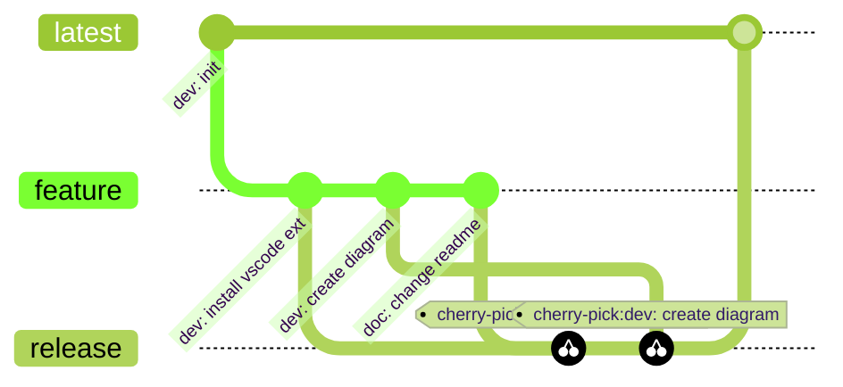

```mermaid
%%{init: { 'logLevel': 'debug', 'theme': 'forest', 'gitGraph': {'showBranches': true, 'rotateCommitLabel': true, 'mainBranchName': 'latest', 'showCommitLabel': true }} }%%
      gitGraph
        commit id:"dev: init"
        branch feature
        commit id:"dev: install vscode ext"
        commit id:"dev: create diagram"
        commit id:"doc: change readme"
        branch release
        cherry-pick id:"dev: install vscode ext"
        cherry-pick id:"dev: create diagram"
        checkout latest
        merge release
```